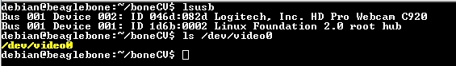
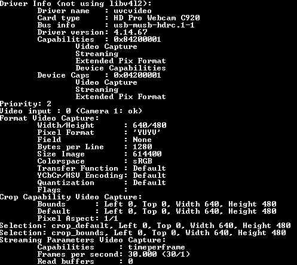

# BeagleBone Blue Webcam
This project is meant to demonstrate the capabilities of the BeagleBone Blue using the BoneCV library in order to capture images to be used for machine learning.

## Pre-Installation 

Make sure that the webcam is plugged into the BeagleBone before proceeding through the instructions. 

Next use the command `lsusb` to find whether the webcam device is shown. Then make sure that typing `ls /dev/video*` from the root directory that `/dev/video0` shows up



If the webcam does not show up on the devices that means that the webcam is probably not being detected correctly. The following procedures are steps that can be taken to resolve this issue.
1. Replugging the webcam usb into the BeagleBone Blue
2. Rebooting the BeagleBone Blue
3. Making sure that the AC power supply functions properly

### Other required libraries 

The following packages are neceesary to be able to use the webcam for the BeagleBone. 
+ `libv4l-dev`: Used with Derek Molloy's boneCV program.
+ `v4l-utils`: Outputs the webcam's performance capabilities including what kind of resolution it can capture.
+ `ffmpeg`: Used for turning the output of the camera's RAW files into other formats such as mp4.
+ `opencv` (The method to install this slightly different from the packages above.)

The method to install these packages using a Ubuntu/Debian machine is by using the `sudo apt-get install` command. For instance, `sudo apt-get install libv4l-dev` is an example of installing the package.

#### OpenCV
One of the main issues that you may encounter when attemping to install a package like OpenCV is having not enough partition space to install the package. In order to solve this on the BeagleBone Blue simply become a super user by using the command `sudo -i` or by simply typing `sudo`  in front of the command that you want to input.

In order to check how much volume is available on the BeagleBone Blue we can use the command `sudo ls /dev/mmcblk*`. To examine the partitioning of the external SD card the command `fdisk /dev/mmcblk0` is used. After that press 'p' in order to print out the settings of your BeagleBone Blue. The results should look similar to this with a few changes: 
```Command (m for help): p

Disk /dev/mmcblk0: 7.4 GiB, 7948206080 bytes, 15523840 sectors
Units: sectors of 1 * 512 = 512 bytes
Sector size (logical/physical): 512 bytes / 512 bytes
I/O size (minimum/optimal): 512 bytes / 512 bytes
Disklabel type: dos
Disk identifier: 0x18e8111b

Device         Boot Start     End Sectors  Size Id Type
/dev/mmcblk0p1       8192 7667712 7659521  3.7G 83 Linux

Command (m for help):
```
In order to delete a partition simply press 'd'. Next to create a new partition simply press 'n'. Press enter twice to use the default values for partition type and number. For the start sector you must use the start sector that the previous partition had. For the last sector you can use however amount of space is left on the micro SD or use the max amount possible by pressing enter.

This is an example of what the process might look like:
```Command (m for help): d
Selected partition 1
Partition 1 has been deleted.

Command (m for help): n
Partition type
   p   primary (0 primary, 0 extended, 4 free)
   e   extended (container for logical partitions)
Select (default p): 

Using default response p.
Partition number (1-4, default 1): 
First sector (2048-15523839, default 2048): 8192
Last sector, +sectors or +size{K,M,G,T,P} (8192-15523839, default 15523839): 

Created a new partition 1 of type 'Linux' and of size 7.4 GiB.
``` 
Now that that is done we must save the changes made to the partition. Press 'w' in order to save the changes that were made or press &lt;CTRL&gt;+C to cancel the process. 
```
Command (m for help): w

The partition table has been altered!

Calling ioctl() to re-read partition table.

WARNING: Re-reading the partition table failed with error 16: Device or resource busy.
The kernel still uses the old table. The new table will be used at
the next reboot or after you run partprobe(8) or kpartx(8)
Syncing disks.
```
If you see the warning above that means you have repartitioned the disk you have booted from. Rebooting the system with `reboot` solves that issue.

Finally after BeagleBone Blue reboots, the file system has to be expanded. Use the command `resize2fs /dev/mmcblk0p1`

To install the OpenCV package the following command can be used `sudo apt-get install libopencv-dev python3-opencv`


## Installation
The next step is to install boneCV onto the machine. To do that you can clone the [repository](https://github.com/derekmolloy/boneCV) and add it to your desired destination. If you have `git` then you can simply create your desired folder and then use `git clone https://github.com/derekmolloy/boneCV` to clone the repository into the folder that was created. 

Next enter the folder that was cloned and run `./build` to install boneCV. 

The webcam's specifications are also very important in a later step and we can see these specifications by using the following command: `v4l2-ctl --all | less`. The output should look similar to the pictured attached below.



In order for the camera to capture at the webcam's specific resolutiion we have to edit the capture.c file in order for it to match the webcam's settings. Using the settings found in the previous command replace the settings in capture.c with the ones that webcam has. 

To record a video the following command can be used to capture at 30 frames per second: `./capture -F -c 300 -o > output.raw
`. This command captures the surroundings for 10 seconds and then places it into a file called output.raw. 

Finally The output can then be converted into a more usable format, such as mp4. This can be done through the command `./raw2mpg4
`. By default it is `ffmpeg -f h264 -i output.raw -vcodec copy output.mp4`.

